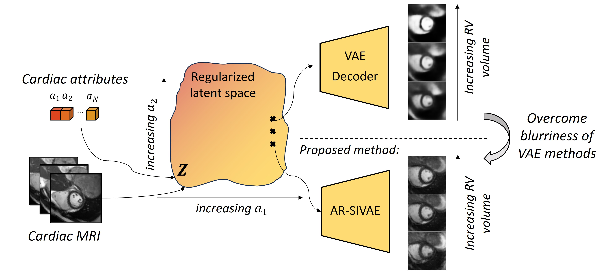
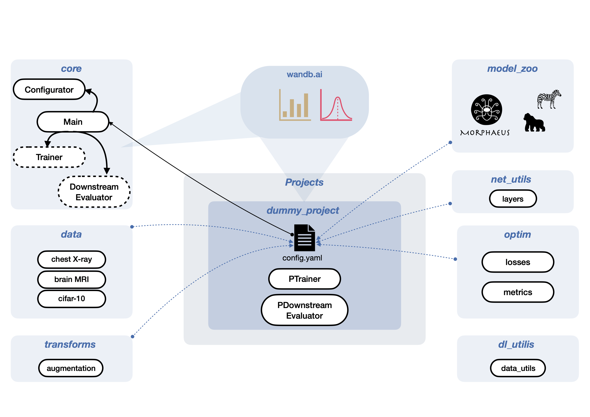

# Interpretable Representation Learning of Cardiac MRI via Attribute Regularization

**Maxime Di Folco**, Cosimin I. Bercea, Emily Chan, Julia A. Schnabel

Accepted at [MICCAI 2024](https://conferences.miccai.org/2024/en/)


**Abstract:** *Interpretability is essential in medical imaging to ensure that clinicians can comprehend and trust artificial intelligence models. Several approaches have been recently considered to encode attributes in the latent space to enhance its interpretability. Notably, attribute regularization aims to encode a set of attributes along the dimensions of a latent representation. However, this approach is based on Variational AutoEncoder and suffers from blurry reconstruction. In this paper, we propose an Attributed-regularized Soft Introspective Variational Autoencoder that combines attribute regularization of the latent space within the framework of an adversarially trained variational autoencoder. We demonstrate on short-axis cardiac Magnetic Resonance images of the UK Biobank the ability of the proposed method to address blurry reconstruction issues of variational autoencoder methods while preserving the latent space interpretability.*

<div style="text-align:center;" align="center">
  
</div>


## Citation
If you use this code, please cite our paper:

```
@article{di_folco2024interpretable,
  title={Interpretable Representation Learning of Cardiac MRI via Attribute Regularization},
  author={Di Folco, Maxime and Bercea, Cosmin I and Chan E and Schnabel, Julia A},
  journal={arXiv preprint arXiv:2406.08282},
  year={2024}
}
```

## Contents of this repository:

- `projects/interp_rep/data_prepocessing`: notebook to adapt the ACDC dataset to the pipeline and the attributes use to regularize
- `projects/interp_rep/`: training and testing the proposed method AR-SIVAE and the method they compare against. Based on: [IML-CompAI Framework](https://github.com/compai-lab/iml-dl) 

All computations were performed using Python 3.8.18 and PyTorch 1.12.1


## Setup:

For setting up wandb please refer to [IML-CompAI Framework](https://github.com/compai-lab/iml-dl).


Overview Deep Learning Framework




## Train a network

After applying all of the preprocessing steps, you can run:

```
python core/Main.py --config_path projects/interp_rep/config/config_***.yaml
```
